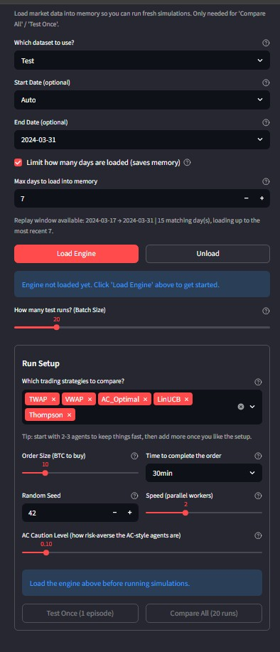
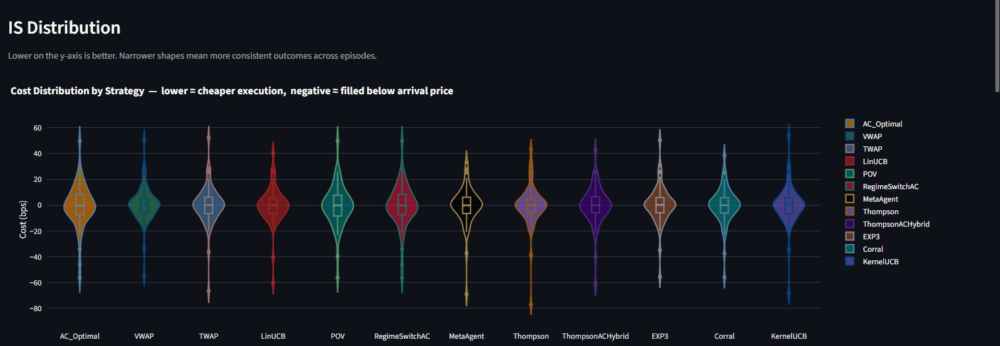
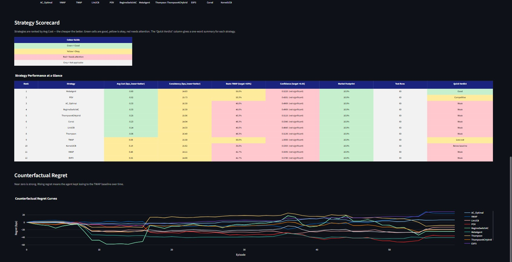
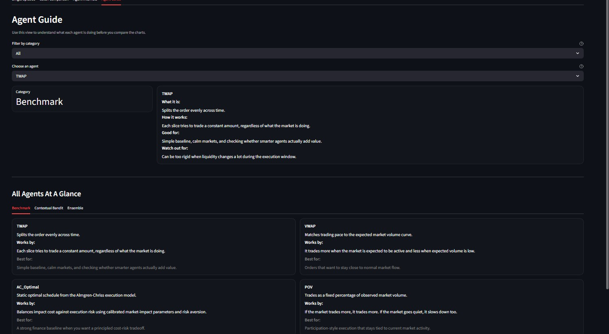

# Execution Agent

Execution Agent is a historical market-replay and execution backtesting platform for studying how benchmark schedulers, contextual bandits, and ensemble policies execute large crypto orders under realistic market microstructure.

## Overview

The system replays Binance futures market data and evaluates execution policies on the task of completing a parent order over a fixed horizon. It is designed for comparing static schedulers such as TWAP, VWAP, and Almgren-Chriss against adaptive agents that react to market state, inventory, urgency, and liquidity conditions.

The project combines data ingestion, feature engineering, market replay, execution simulation, agent evaluation, and interactive analysis in a single workflow.

## Core Capabilities

- Download and parse Binance futures `aggTrades` and `bookTicker` datasets into local Parquet files
- Build reusable market artifacts including intraday volume profiles, impact calibration parameters, and feature normalization statistics
- Replay historical market conditions through an execution simulator with inventory and timing constraints
- Compare benchmark, contextual bandit, and ensemble execution agents on identical episodes
- Evaluate implementation shortfall, VWAP slippage, participation, win rate, and regret
- Explore results through a Streamlit dashboard with single-episode analysis, batch comparisons, agent internals, and metric guidance

## Supported Agents

### Benchmark Schedulers
- `TWAP`
- `VWAP`
- `AC_Optimal`
- `POV`
- `RegimeSwitchAC`

### Contextual And Adaptive Agents
- `LinUCB`
- `Thompson`
- `EXP3`
- `KernelUCB`

### Ensemble And Meta Agents
- `MetaAgent`
- `ThompsonACHybrid`
- `Corral`

## Dashboard Features

- Single-episode execution trajectory views
- Action and urgency traces over time
- Slice-level implementation shortfall contribution
- Context heatmaps and bandit weight visualizations
- Batch comparison charts across agents
- Regret summaries and learning diagnostics
- Plain-language guidance for interpreting key metrics
- Agent guide describing how each policy works

## Dashboard Preview









## System Architecture

```text
execution-engine/
|-- agents/        # Benchmark, bandit, and ensemble execution agents
|-- config/        # Typed config, defaults, and generated calibration artifacts
|-- dashboard/     # Streamlit dashboard and plotting components
|-- data/          # Raw downloads, parsed parquet, and derived market artifacts
|-- evaluation/    # Batch evaluation, metrics, and saved results
|-- features/      # Context construction and normalization
|-- pipeline/      # Download, parse, calibration, and feature-stat scripts
|-- simulator/     # Execution environment, market replay, and impact model
|-- tests/         # Unit, integration, and smoke tests
```

## Data Pipeline

```bash
python pipeline/download_data.py --start 2024-01-01 --end 2024-03-31
python pipeline/parse_data.py
python pipeline/build_volume_profile.py
python pipeline/calibrate_params.py
python pipeline/build_feature_stats.py
```

## Local Setup

```bash
git clone <repo-url>
cd execution-engine
python -m venv .venv
# Windows
.venv\Scripts\activate
# macOS/Linux
# source .venv/bin/activate
pip install -r requirements.txt
```

## Validation And Dashboard

```bash
python -m pytest -q
python -m streamlit run dashboard/app.py
```

## Sample Artifact

A curated demo batch result is included at [`evaluation/results/sample_batch_results.json`](evaluation/results/sample_batch_results.json). It contains a 60-episode dashboard batch run across 12 agents and can be used to review the dashboard in saved-results mode without generating a fresh batch first.

## Evaluation Metrics

- `Implementation Shortfall (IS)`: execution cost relative to the arrival benchmark
- `VWAP Slippage`: execution quality relative to market VWAP
- `Participation Rate`: how aggressively the order consumes market volume
- `Win Rate vs Baselines`: how often an agent outperforms TWAP or AC on individual episodes
- `Regret`: performance gap versus a reference policy

## Example Findings

The included sample batch artifact (`n_episodes = 60`) highlights several useful patterns from the current simulator configuration:

1. `MetaAgent` produced the strongest mean implementation shortfall in the sample batch at roughly `-0.60 bps`, outperforming `TWAP` (`+0.08 bps`) and `VWAP` (`+0.48 bps`) on the batch average.
2. `POV` and `MetaAgent` both posted negative mean shortfall with win rates above `50%` versus `TWAP`, suggesting that adaptive pacing can improve average execution quality in this replay window.
3. `EXP3` and `KernelUCB` lagged the stronger agents in the sample batch, with positive mean shortfall and weaker win rates against `TWAP`, showing that not every adaptive method is automatically superior in this setting.
4. `AC_Optimal` and `RegimeSwitchAC` matched exactly in the included sample, indicating that the selected regime logic did not materially alter the execution path for that replay window.
5. The one-sided p-values versus `TWAP` remain far from conventional significance thresholds across the sample batch, so the artifact should be interpreted as exploratory evidence rather than a claim of statistically decisive outperformance.

## Engineering Characteristics

- Modular pipeline, simulator, feature, evaluation, and dashboard layers
- Typed config loading and generated calibration artifacts
- Support for benchmark, contextual bandit, and ensemble execution agents
- Extended 18-dimensional feature set with interaction terms
- Inventory-aware exploration decay and counterfactual regret tracking
- Resource-aware dashboard loading with date-window controls and lazy engine initialization
- Automated tests covering agents, pipeline behavior, and dashboard-safe execution paths

## Limitations

- This is a research and backtesting system, not a live trading engine.
- Impact calibration is heuristic and should not be treated as a production execution model.
- Historical replay quality depends on the selected market data window and generated artifacts.
- Large replay windows can still be resource intensive on lower-memory systems.

## Roadmap

- Live paper-trading mode with streaming data
- Additional symbol and custom evaluation-window workflows
- Faster lightweight replay modes for interactive demos
- Hosted dashboard deployment with curated sample outputs
